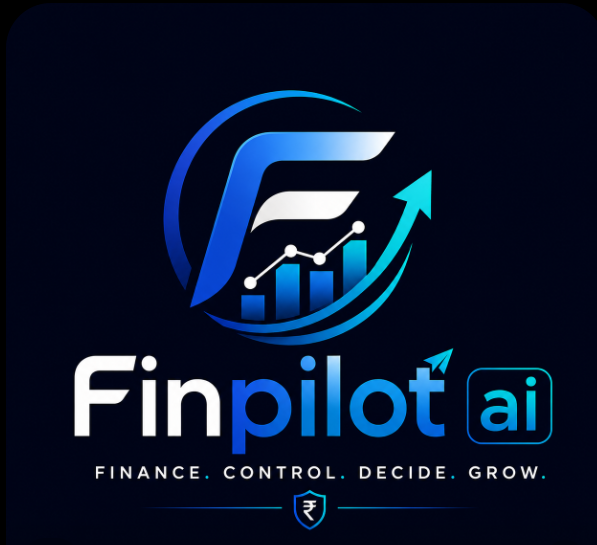
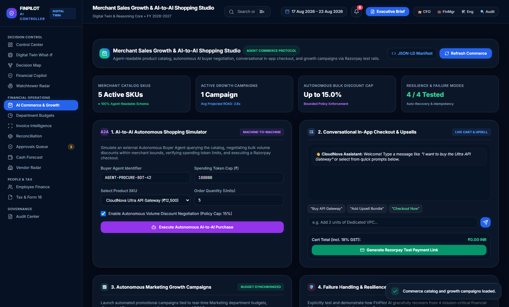
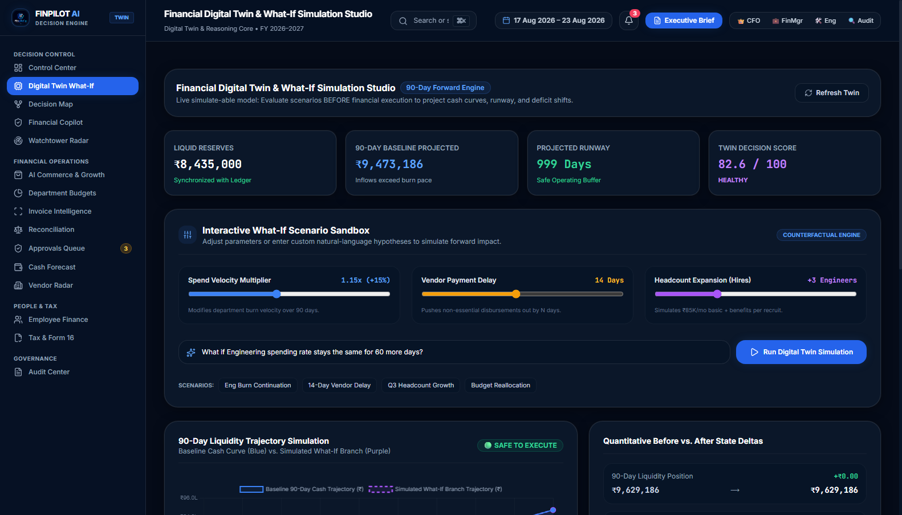
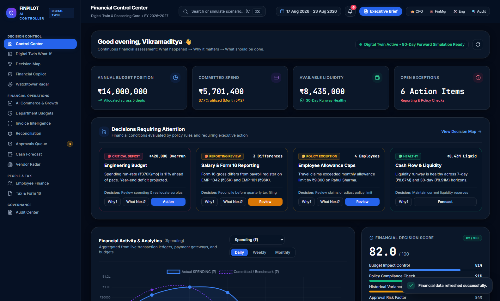
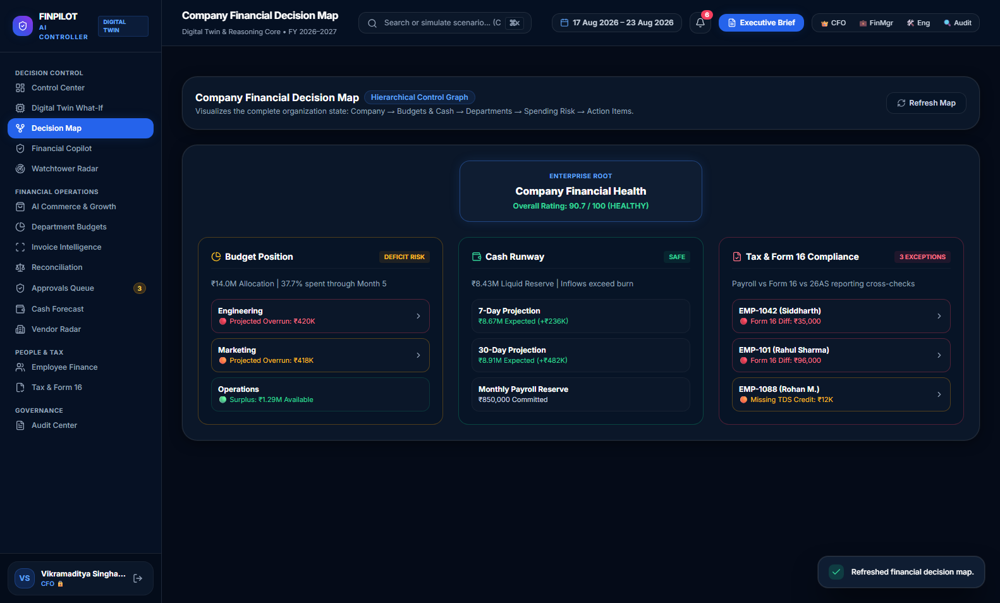
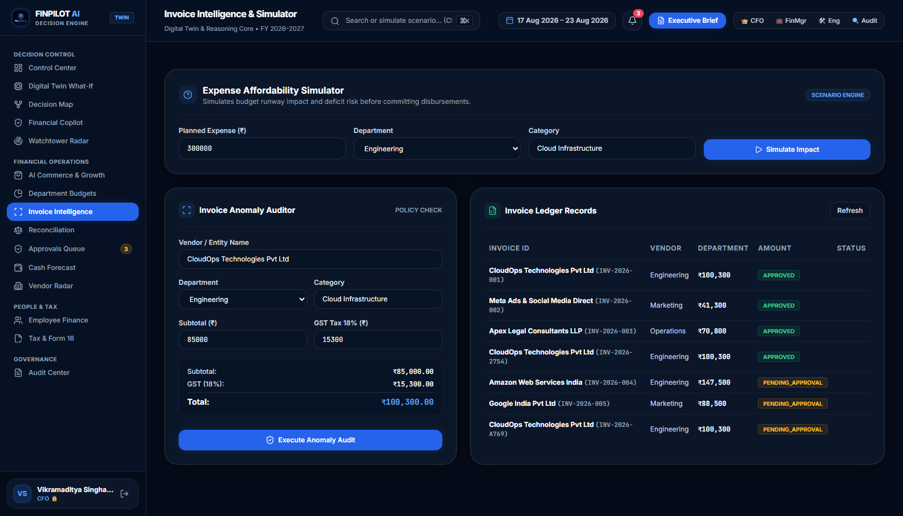
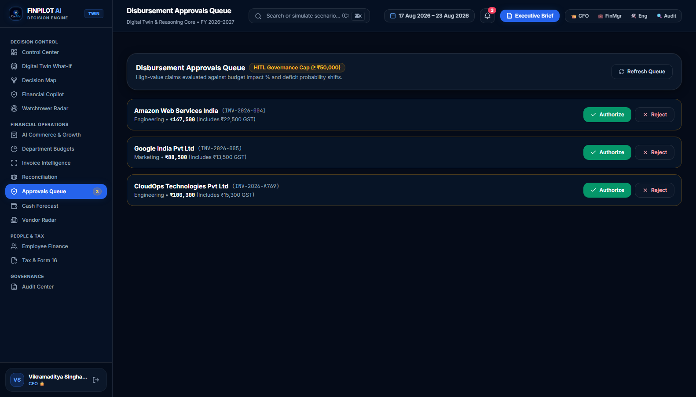
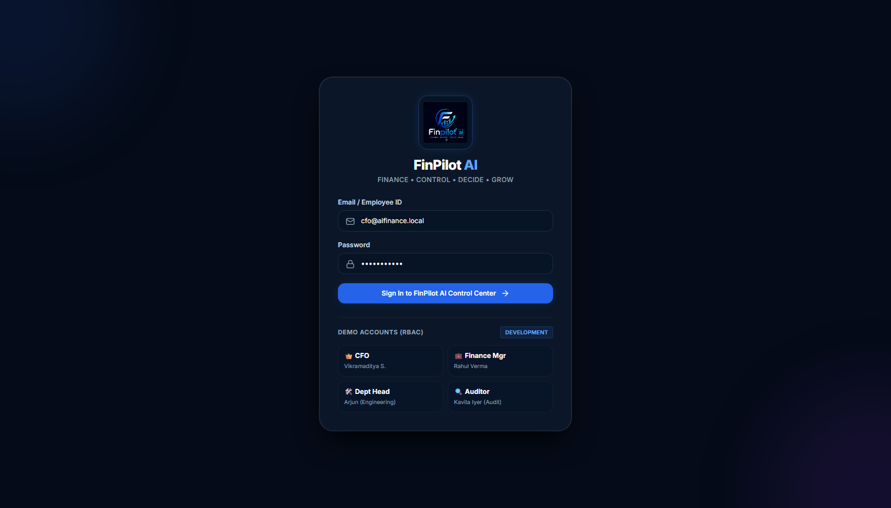
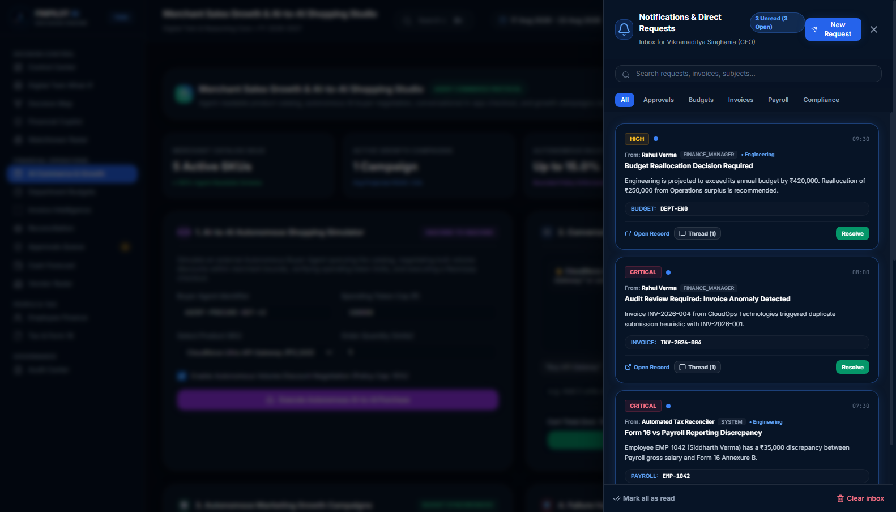

<p align="center">
  
</p>

# FinPilot AI

**Live Demo:** [https://finpilot-ai-s9km.onrender.com/](https://finpilot-ai-s9km.onrender.com/)

> [!NOTE]
> **Cold Start Notice:** First load may take up to 60 seconds while the Render free-tier instance wakes up.

### Demo Role Logins
| Role | Email / Identifier | Password | 1-Click Autologin Link |
|---|---|---|---|
| **CFO** | `cfo@aifinance.local` | `password123` | [Launch CFO Workspace](https://finpilot-ai-s9km.onrender.com/?autologin=cfo) |
| **Finance Manager** | `financemanager@aifinance.local` | `password123` | [Launch Finance Manager Workspace](https://finpilot-ai-s9km.onrender.com/?autologin=fm) |
| **Department Head** | `depthead@aifinance.local` | `password123` | [Launch Department Head Workspace](https://finpilot-ai-s9km.onrender.com/?autologin=head) |
| **Auditor** | `auditor@aifinance.local` | `password123` | [Launch Auditor Workspace](https://finpilot-ai-s9km.onrender.com/?autologin=auditor) |

We built FinPilot AI to solve a core problem growing businesses face: financial decisions are fragmented across spreadsheets, accounting exports, and delayed approvals. When finance teams review invoices, allocate department budgets, or approve large disbursements, they lack immediate visibility into forward cash runway and policy compliance.

FinPilot AI gives finance managers, department heads, and executives a unified financial orchestration workspace. We combine deterministic backend calculations (exact 18% GST audit rules, statutory payroll deductions, hard budget limits) with LangGraph-orchestrated agents for natural language financial queries, root-cause anomaly detection, and forward cash-flow simulation. On the merchant commerce side, the system provides machine-readable catalog manifests (`/v1/commerce/ai-manifest`), bounded AI-to-AI procurement negotiation, and conversational in-app checkout linked to Razorpay payment rails.

[](https://github.com/GAUTAMX05/FinPilot-Ai/actions/workflows/tests.yml)
[](https://www.python.org/downloads/)
[](https://fastapi.tiangolo.com)
[](https://langchain-ai.github.io/langgraph/)
[](https://razorpay.com)
[](https://opensource.org/licenses/MIT)

---

## Razorpay AI Agent Track — Compliance Reference

| Track Requirement | Implementation in FinPilot AI | Interactive Endpoint / View |
|---|---|---|
| **Grows Merchant Sales** | Smart cross-sell / upsell recommender and autonomous marketing campaign orchestrator synced with budget balances. | `POST /v1/commerce/campaigns/create`<br>`POST /v1/commerce/conversational-checkout`<br>*(Tab: AI Commerce & Growth)* |
| **Enables AI-to-AI Shopping** | Machine-readable catalog manifest (`/v1/commerce/ai-manifest` in JSON-LD / Schema.org) and bounded autonomous buyer agent with spending token limits. | `GET /v1/commerce/ai-manifest`<br>`POST /v1/commerce/ai-buy`<br>*(Tab: AI Commerce & Growth)* |
| **Conversational In-App Checkout** | Natural language cart parsing, line item extraction, statutory 18% GST calculation, and Razorpay test payment links. | `POST /v1/commerce/conversational-checkout`<br>*(Live Chat Panel in Tab 13)* |
| **Agent-Readable Catalogs** | Structured product catalog exposing IDs, specifications, tax codes, stock levels, and volume discount tiers to autonomous agents. | `GET /v1/commerce/ai-manifest`<br>`GET /v1/commerce/catalog` |
| **Automated Cross-Sell / Upsell** | Recommends complementary bundles (e.g. API Gateway + Dedicated VPC) with automated savings calculations. | Integrated in In-App Checkout & Conversational Chat |
| **Autonomous Campaign Orchestrators** | Deducts promotional spend from department marketing budget, deploys payment links, and tracks projected ROAS. | `POST /v1/commerce/campaigns/create`<br>*(Panel 3 in Tab 13)* |
| **Razorpay Test-Mode APIs** | Test-mode payment links (`https://rzp.io/i/...`), webhook signature verification, idempotency keys, and payment state synchronization. | `src/app/services/razorpay_service.py` |

---

## Known Limitations

1. **In-Memory State & Seeded Datasets:** The application uses in-memory data repositories initialized from `enterprise_dataset.json` rather than a persistent external SQL database (PostgreSQL/MySQL). State resets when the server process restarts.
2. **Simulated Agent-to-Agent Negotiation:** The AI-to-AI buyer-seller negotiation runs locally through deterministic bounded algorithms and semantic rule sets rather than separate decentralized network nodes.
3. **Test-Mode Payment Rails:** Razorpay integration operates on test API keys with synthetic fallback link generation when live API keys are not provided in environment variables.
4. **Single-Tenant Workspace:** The system simulates enterprise RBAC roles (CFO, Finance Manager, Department Head, Auditor) across a single organization dataset rather than isolated multi-tenant workspaces.

---

## Application Interface & Core Workflows

### 1. Merchant Sales Growth & AI Commerce Studio
*Agent-readable product catalog (`/v1/commerce/ai-manifest`), autonomous AI buyer volume negotiation within strict policy bounds, conversational in-app checkout with smart upsell bundles, and growth campaigns via Razorpay test rails.*


---

### 2. Forward Cash-Flow & Scenario Simulation Studio
*Interactive simulation model: evaluate forward spend velocity, deferred vendor payouts, and headcount expansion before committing transactions.*


---

### 3. Executive Control Center
*Real-time corporate cash positions, department burn rates, and automated decision review triggers.*


---

### 4. Company Financial Decision Map
*Hierarchical control graph mapping Enterprise Root $\rightarrow$ Budgets & Cash $\rightarrow$ Department Risks $\rightarrow$ Actions.*


---

### 5. Invoice Intelligence & GST Compliance Auditor
*Automated 18% GST calculation, duplicate invoice detection, and department runway affordability checks.*


---

### 6. Human-in-the-Loop (HITL) Disbursement Approvals
*Autonomous threshold enforcement with 1-click Razorpay payment link generation for disbursements $\ge$ ₹50,000.*


---

### 7. Role-Based Access Control (RBAC) Authentication
*Authentication with four pre-configured roles: CFO, Finance Manager, Department Head, and Auditor.*


---

### 8. Role-Scoped Notifications Drawer
*Notification delivery scoped to authenticated users with threaded conversations and entity routing.*


---

## Core System Architecture

FinPilot AI separates deterministic calculations from probabilistic AI reasoning:

| Domain | Mechanism | Architectural Rationale |
|---|---|---|
| **18% GST, Subtotals & Ledger Math** | Deterministic Rules Engine | Arithmetic is executed in pure Python to prevent LLM token calculation errors. |
| **Spending Limits & ₹50K HITL Thresholds** | Hard Validation Guardrails | Ceilings and thresholds are enforced at the API layer before payment rails are called. |
| **RBAC & Data Scoping** | Auth Middleware | Role and department matching ensures users only access authorized financial records. |
| **Audit Logging** | SHA-256 Hash Chaining | Each audit entry is linked to the previous log entry to maintain tamper evidence. |
| **Natural Language Parsing** | Semantic Agent | Parses conversational purchasing requests and unstructured user queries. |
| **Root-Cause Analysis** | Causal Correlation Agent | Correlates financial variances with operational events (vendor additions, tax adjustments). |
| **Forward Scenario Narration** | Narrator Agent | Generates structured, role-tailored summaries of simulation results. |
| **AI Buyer Negotiation** | Bounded Negotiation Engine | Bounded volume discount negotiation capped by merchant discount ceilings (max 15%). |

---

## Project Structure

```
FinPilot_Ai/
├── src/
│   └── app/
│       ├── api/
│       │   └── endpoints/     # Commerce, Simulation, Invoices, Budgets, Approvals, Payroll, Chat
│       ├── core/              # Config, Security, Policy rules, RBAC middleware
│       ├── data/              # Merchant catalog, enterprise dataset, benchmarks
│       ├── graphs/            # LangGraph multi-agent workflow state machine
│       ├── services/          # Commerce, Simulation, Policy Calibration, Multi-Agent Orchestrator
│       ├── static/            # Frontend single-page application & AI Commerce Studio
│       └── main.py            # Application entrypoint
├── docs/
│   └── screenshots/           # UI captures (01 - 10)
├── tests/                     # Automated test suites
├── WALKTHROUGH.md             # System walkthrough and API documentation
└── pyproject.toml             # Project dependencies and packaging
```

---

## Quickstart

### 1. Clone & Install
```bash
git clone https://github.com/GAUTAMX05/FinPilot-Ai.git
cd FinPilot-Ai
pip install -e .
```

### 2. Configure Environment
```bash
cp .env.example .env
# Optional: Add OPENAI_API_KEY and RAZORPAY API keys (app boots in fallback mode if omitted)
```

### 3. Launch Server
```bash
python run_server.py
```
- **Web Dashboard**: `http://localhost:8000/`
- **Commerce Studio**: `http://localhost:8000/?autologin=cfo&tab=commerce`
- **Agent Manifest (JSON-LD)**: `http://localhost:8000/v1/commerce/ai-manifest`
- **Swagger API Docs**: `http://localhost:8000/docs`
- **Health Check**: `http://localhost:8000/health`

---

## Automated Test Suites

```bash
# Merchant Growth & AI-to-AI Shopping Suite
python tests/test_commerce_and_ai_shopping.py

# Digital Twin & Multi-Agent Tests
python tests/test_digital_twin_and_agents.py

# Decision Engine Suite
python tests/test_decision_engine_upgrade.py

# AI Chat & Reasoning Pipeline
python tests/test_ai_chat_pipeline.py
```

---

## Deployment

The application is configured for 1-click cloud deployment on Render (or any container/PaaS host):

1. **Blueprint Deployment (Render):**
   - Connect the repository `GAUTAMX05/FinPilot-Ai` in [Render Dashboard](https://dashboard.render.com/).
   - Select **New +** $\rightarrow$ **Blueprint** (Render reads `render.yaml` automatically).
   - Build Command: `pip install -r requirements.txt && pip install -e .`
   - Start Command: `python run_server.py`
2. **Port Binding:** The server listens on `0.0.0.0` and reads the dynamically assigned `$PORT` environment variable.
3. **Resilient Startup:** If `OPENAI_API_KEY` or `RAZORPAY_KEY_ID` are not configured in environment variables, the service automatically boots into deterministic simulation mode with full demo data and functional endpoints.

---

## 📖 In-Depth System Documentation
- [WALKTHROUGH.md](WALKTHROUGH.md) — Comprehensive architectural breakdown, simulation math, and API schemas.
