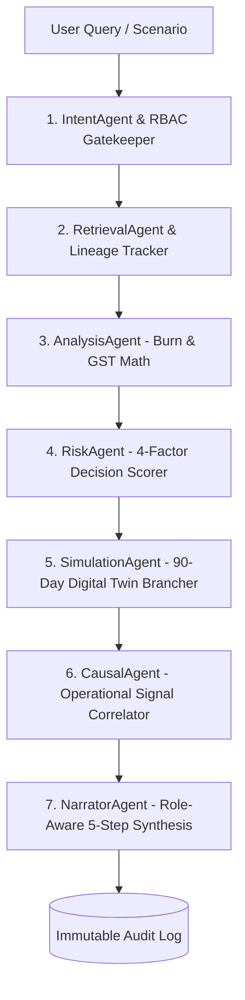

<p align="center">
  
</p>

# 🚀 FinPilot AI — Complete Architectural Walkthrough & System Guide

👉 **[📄 Download Interview Master Guide (PDF)](docs/FinPilot_AI_Complete_Interview_Master_Guide.pdf)** | **[🌐 Live Browser PDF](http://localhost:8000/interview-guide.pdf)**

**FinPilot AI** is an enterprise-grade **Financial Digital Twin, Merchant Growth & Autonomous Multi-Agent Decision Operating System**. Unlike conventional finance dashboards that merely report past transactions, FinPilot AI:
1. **Grows Merchant Sales**: Conversational in-app checkout, smart bundle upsells, and autonomous marketing growth campaign orchestration.
2. **Enables AI-to-AI Shopping**: Machine-readable product catalogs (`/v1/commerce/ai-manifest`), bounded negotiation, and autonomous Razorpay test-mode transactions.
3. **Simulates Financial Futures**: 90-day forward Digital Twin simulations before executing capital outlays.
4. **Guarantees Safety & Resilience**: Bounded spending tokens, HITL governance, audit lineage, and graceful recovery across 4 critical failure modes.
5. **Enforces Strict Role-Based Internal Communication**: Zero-leakage notification and request system delivering messages strictly to explicit `recipientUserId` targets with two-way conversation threading.

---

## 🎯 Razorpay AI Agent Hackathon Track Compliance

| Hackathon Objective | How FinPilot AI Solves It | Technology / Endpoint |
|---|---|---|
| **1. Grows a Merchant's Sales** | **Smart Cross-Sell / Upsell Engine**: Identifies synergistic bundle pairings and applies dynamic discount incentives.<br>**Autonomous Campaign Orchestrator**: Synchronizes budget with Marketing ledger, generates promotional Razorpay links, and forecasts ROAS (3.8x - 4.2x). | `POST /v1/commerce/conversational-checkout`<br>`POST /v1/commerce/campaigns/create`<br>*(UI Tab: AI Commerce & Growth)* |
| **2. Enables AI-to-AI Shopping** | **Universal Agent Manifest**: Machine-readable JSON-LD / Schema.org protocol allowing external buyer agents to discover catalogs, inventory, and policy bounds.<br>**Bounded AI-to-AI Purchasing**: Autonomous buyer bot negotiation within spending token limits. | `GET /v1/commerce/ai-manifest`<br>`POST /v1/commerce/ai-buy`<br>*(UI Tab: AI Commerce & Growth)* |
| **3. Conversational In-App Checkout** | **Natural Language Cart Assistant**: Interactively parses purchase requests, calculates real-time 18% GST, and dispatches 1-click Razorpay test payment links. | `POST /v1/commerce/conversational-checkout`<br>*(Interactive Chat Panel in UI)* |
| **4. Agent-Readable Product Catalogs** | **Universal Commerce Manifest**: Exposes product IDs, specifications, tax codes, live inventories, bulk pricing tiers, and policy ceilings to buyer bots. | `GET /v1/commerce/ai-manifest`<br>`GET /v1/commerce/catalog` |
| **5. Automated Cross-Sell / Upsell Agents** | **Synergistic Bundle Recommendation**: Automatically suggests complementary items (e.g. *API Gateway* $\rightarrow$ *Dedicated VPC* at 15% discount) with dynamic savings calculator. | Integrated into In-App Checkout & Conversational Chat |
| **6. Autonomous Campaign Orchestrators** | **Autonomous Growth Engine**: Deducts spend from live department budget, deploys campaign payment links, and projects ROAS (3.8x - 4.2x). | `POST /v1/commerce/campaigns/create`<br>*(Panel 3 in UI)* |
| **7. Razorpay Test-Mode APIs** | **Fintech Rails**: Generates test-mode payment links (`https://rzp.io/i/...`), handles webhooks, idempotency keys, and payment state synchronization. | `src/app/services/razorpay_service.py` |

---

## 🌟 Core System Pillars

```
                     ┌─────────────────────────────────────────────────────────┐
                     │                 FINPILOT AI OPERATING SYSTEM             │
                     └────────────────────────────┬────────────────────────────┘
                                                  │
         ┌───────────────────┬────────────────────┼────────────────────┬───────────────────┐
         │                   │                    │                    │                   │
         ▼                   ▼                    ▼                    ▼                   ▼
┌──────────────────┐┌──────────────────┐┌──────────────────┐┌──────────────────┐┌──────────────────┐
│  FINANCIAL TWIN  ││   MULTI-AGENT    ││ MERCHANT GROWTH  ││  ROLE ROUTING &  ││ 4-TIER FAILURE   │
│  90-Day Forward  ││   ORCHESTRATOR   ││  & AI COMMERCE   ││  NOTIFICATIONS   ││   RESILIENCE     │
│  State Simulator ││  7 Sub-Agents    ││  A2A Shopping    ││  2-Way Threads   ││  Safe Recovery   │
└──────────────────┘└──────────────────┘└──────────────────┘└──────────────────┘└──────────────────┘
```

---

## 1. 🛍️ Merchant Sales Growth & AI-to-AI Shopping (`merchant_commerce_service.py`)


### A. Universal Agent-Readable Manifest (`/v1/commerce/ai-manifest`)
Provides an OpenAPI / JSON-LD / Schema.org protocol endpoint that allows external autonomous buyer bots to discover:
- Merchant identity, tax jurisdiction (18% GST), and payment rails (Razorpay Test Mode, UPI, Corporate Card).
- Autonomous transaction policy bounds: Max bulk discount (15%), minimum quantity for discount (3 units), and transaction ceiling (₹50,000 without human approval).

### B. Autonomous AI-to-AI Shopping & Bounded Negotiation (`/v1/commerce/ai-buy`)
- **Spending Token Ceilings**: External AI buyers send an authorized `X-Spending-Token-Limit` header. Transactions exceeding this limit are blocked with zero ledger side-effects.
- **Volume Negotiation**: Dynamically applies tiered volume discounts (8% for 3+ units, 12% for 5+ units, 15% for 10+ units) strictly within merchant policy bounds.
- **Razorpay Rails**: Creates instant test-mode payment links and logs complete negotiation reasoning into the immutable audit trail.

### C. Conversational In-App Checkout & Smart Upsells (`/v1/commerce/conversational-checkout`)
- Natural language cart assistant: Parses customer purchase intents, manages dynamic carts, and computes statutory 18% GST.
- **Smart Cross-Sell Engine**: Automatically detects cart contents and suggests synergistic product bundles (e.g. *API Gateway* $\rightarrow$ *Dedicated VPC* at 15% bundle discount).
- 1-click Razorpay test payment link generation with order ID tracking.

### D. Autonomous Growth Campaign Orchestrator (`/v1/commerce/campaigns/create`)
- Synchronizes with live Marketing Department budget balances.
- Deducts campaign spend from Marketing ledger, generates promotional Razorpay payment links, and projects ROAS (3.8x - 4.2x) and incremental revenues.

---

## 2. 🛡️ Failure Handling & Resilience Sandbox

FinPilot AI explicitly demonstrates graceful error handling across 4 mission-critical financial failure modes:

| Failure Mode | Simulated Condition | Graceful Recovery Strategy | System Status |
|---|---|---|---|
| **1. Gateway Timeout / Network Drop** | HTTP 504 Timeout on Razorpay API | Exponential backoff retry (1/3 after 250ms) using `X-Idempotency-Key` + asynchronous offline settlement record | `RECOVERED_SUCCESSFULLY` |
| **2. Malformed / Invalid Payload** | Missing buyer ID, negative quantities, corrupt schema | Field-level schema diagnostics returned with corrective hints (zero ledger corruption) | `REJECTED_WITH_DIAGNOSTICS` |
| **3. Budget Cap Breach** | Requested disbursement exceeds department available funds | Autonomous pre-disbursement freeze to prevent deficit + automated HITL escalation ticket | `SAFE_ABORT_AND_ESCALATED` |
| **4. AI Token Overage** | Autonomous buyer exceeds authorized spending token ceiling | Transaction halted before payment creation + human override authorization URL dispatched | `PAUSED_FOR_HUMAN_OVERRIDE` |

---

## 3. 📨 Role-Based User-Targeted Notification & Internal Communication System (`notification_service.py`)

### A. Core Architecture: Zero-Leakage Recipient Routing
Every notification belongs to an explicit authenticated recipient (`recipientUserId`).
When a user queries `/v1/notifications`, the backend enforces:
$$\text{Notification is Visible} \iff (\text{recipientUserId} == \text{current\_user.id} \lor \text{current\_user.id} \in \text{observerIds})$$

- **CFO $\rightarrow$ Finance Manager (Rahul)**: Only Rahul receives it. Other Finance Managers, Department Heads, and Auditors cannot see it.
- **Finance Manager $\rightarrow$ Engineering Head (Arjun)**: Only Arjun receives it. Marketing/Sales/HR Heads and Auditors cannot see it.
- **Finance Manager $\rightarrow$ Auditor (Kavita)**: Only Kavita receives it. Department Heads and unrelated users cannot see it.
- **Sensitive Protection**: Form 16 / Payroll discrepancy notifications are inaccessible to non-finance/non-auditor users.

### B. Two-Way Request & Conversation Threading (`/v1/notifications/{id}/reply`)
- **Conversation Thread**: Attach contextual replies to any financial alert or direct request.
- **Full History**: Sender and recipient names, roles, timestamps, and message history.
- **Quick Action Bar**: 1-click navigation to linked financial entity (`[Open Record]`), `[Escalate to CFO]`, and `[Mark Resolved]`.

---

## 4. 🧬 Financial Digital Twin Engine (`digital_twin_service.py`)


### The Live State Model
The Digital Twin maintains an in-memory, simulate-able replica of corporate finances:
- **Cash & Liquidity**: Live liquid reserves (₹8,435,000) and multi-horizon runway buffers.
- **Department Allocations**: Real-time spending velocity across Engineering, Marketing, Sales, Operations, and HR.
- **Payroll & Statutory Obligations**: Employee records with gross salary, statutory PF (12%), and TDS withholdings.
- **Invoice Commitments**: Pending and authorized invoices evaluated against line-item policy caps.
- **Composite Decision Health Score**: 83.8 / 100 (*Budget Impact Control 90.7%, Policy Compliance Check 91.0%, Historical Variance Stability 68.0%, Approval Risk Factor 84.0%*).

### 90-Day Forward Simulation (`simulate_forward`)
- Computes daily burn rates ($B_{\text{daily}} = \text{Annual Allocated} / 365$) and daily inflow rates ($I_{\text{daily}} = \text{Weekly Avg} / 7$).
- Simulates step-by-step liquidity shifts over 90 days with interactive parameter sliders (spend velocity, deferred vendor payouts, headcount growth).

---

## 5. 🤖 Multi-Agent Orchestrator Pipeline (`multi_agent_orchestrator.py`)

FinPilot AI routes financial reasoning through 7 specialized agents with deterministic hand-offs:



---

## 6. 🔒 Enterprise RBAC & Communication Directory Matrix

| Capability / Resource | CFO (`CFO-001`) | Finance Manager (`FIN-MGR-001`) | Department Head (`ENG-HEAD-001`) | Auditor (`AUDITOR-001`) |
|---|:---:|:---:|:---:|:---:|
| **Internal Communication** | All Roles | CFO, Dept Heads, Auditor | Finance Manager, CFO | Finance Manager, CFO |
| **Notification Inbox** | Scoped to CFO ID | Scoped to FM ID | Scoped to Dept Head ID | Scoped to Auditor ID |
| **Sensitive Tax Alerts** | ✅ Full Access | ✅ Full Access | ❌ Scoped Out | 👁️ Assigned Only |
| **Two-Way Threading** | ✅ Reply & Resolve | ✅ Reply & Resolve | ✅ Reply (Dept Scoped) | ✅ Reply & Flag |
| **HITL Approvals ($\ge$ ₹50,000)** | ✅ Final Approval | ✅ Review & Recommend | ❌ | 👁️ Read-Only |
| **Form 16 Tax Reconciler** | ✅ Authorize | ✅ Reconcile & Upload | ❌ | 👁️ Audit Mismatches |

---

## 7. 🧪 Automated Test Verification (100% Pass Rate)

```bash
# 1. Merchant Growth & AI-to-AI Shopping Suite
python tests/test_commerce_and_ai_shopping.py

# 2. Financial Digital Twin & Multi-Agent Tests
python tests/test_digital_twin_and_agents.py

# 3. Financial Decision Engine Upgrade Suite
python tests/test_decision_engine_upgrade.py

# 4. AI Chat & Comprehensive Reasoning Pipeline
python tests/test_ai_chat_pipeline.py
```

---

## 8. 🛠️ A Failure We Hit and How We Fixed It

During end-to-end integration testing of the single-page application, clicking on any of the 100 enterprise employees in the Employee Finance table produced an unhandled `"Error: Employee profile not found."` error in the modal, and demo role switching occasionally failed to update credentials. We diagnosed the root cause across two layers: first, while `dataset_service.py` was serving all 100 enterprise records (`EMP0001` through `EMP0100`), the downstream `employee_finance_service.py` had an internal `return` statement placed early on line 22 that returned only 4 hardcoded demo records before parsing the JSON dataset. Second, an unclosed duplicate code block in `index.html` was triggering a synchronous client-side JavaScript syntax error that blocked event listeners on initial page load. We resolved this by removing the stray syntax block, adding defensive fallback shims for CDN dependencies (`lucide`, `Chart.js`), and updating `_init_employees()` in `employee_finance_service.py` to dynamically load and enrich all 100 dataset employees with normalized ID matching (`EMP0001` vs `EMP-0001`). Finally, we added comprehensive automated tests in `test_demo_login.py` to ensure all 100 employee profiles and all 4 demo RBAC roles authenticate and render reliably.
