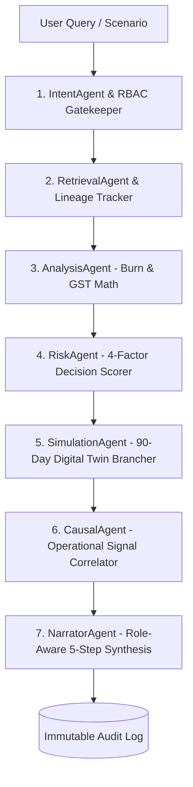

# 🚀 FinPilot AI — Complete Architectural Walkthrough & System Guide

**FinPilot AI** is an enterprise-grade **Financial Digital Twin, Merchant Growth & Autonomous Multi-Agent Decision Operating System**. Unlike conventional finance dashboards that merely report past transactions, FinPilot AI:
1. **Grows Merchant Sales**: Conversational in-app checkout, smart bundle upsells, and autonomous marketing growth campaign orchestration.
2. **Enables AI-to-AI Shopping**: Machine-readable product catalogs (`/v1/commerce/ai-manifest`), bounded negotiation, and autonomous Razorpay test-mode transactions.
3. **Simulates Financial Futures**: 90-day forward Digital Twin simulations before executing capital outlays.
4. **Guarantees Safety & Resilience**: Bounded spending tokens, HITL governance, audit lineage, and graceful recovery across 4 critical failure modes.

---

## 🌟 Core System Pillars

```
                     ┌─────────────────────────────────────────────────────────┐
                     │                 FINPILOT AI OPERATING SYSTEM             │
                     └────────────────────────────┬────────────────────────────┘
                                                  │
         ┌────────────────────────────────────────┼────────────────────────────────────────┐
         │                                        │                                        │
         ▼                                        ▼                                        ▼
┌──────────────────┐                    ┌──────────────────┐                     ┌──────────────────┐
│  FINANCIAL TWIN  │                    │   MULTI-AGENT    │                     │ MERCHANT GROWTH  │
│  90-Day Forward  │                    │   ORCHESTRATOR   │                     │  & AI COMMERCE   │
│  State Simulator │                    │  7 Sub-Agents    │                     │  A2A Shopping    │
└──────────────────┘                    └──────────────────┘                     └──────────────────┘
```

---

## 1. 🛍️ Merchant Sales Growth & AI-to-AI Shopping (`merchant_commerce_service.py`)


### A. Universal Agent-Readable Manifest (`/v1/commerce/ai-manifest`)
Provides an OpenAPI / JSON-LD / Schema.org protocol endpoint that allows external autonomous buyer bots to discover:
- Merchant identity, tax jurisdiction (18% GST), and payment rails (Razorpay Test Mode, UPI, Corporate Card).
- Autonomous transaction policy bounds: Max bulk discount (15%), minimum quantity for discount (3 units), and transaction ceiling (₹50,000 without human approval).

### B. Autonomous AI-to-AI Shopping & Bounded Negotiation (`/v1/commerce/ai-buy`)
- **Spending Token Ceilings**: External AI buyers send an authorized `X-Spending-Token-Limit` header. Transactions exceeding this limit are blocked with zero ledger side-effects.
- **Volume Negotiation**: Dynamically applies tiered volume discounts (8% for 3+ units, 12% for 5+ units, 15% for 10+ units) strictly within merchant policy bounds.
- **Razorpay Rails**: Creates instant test-mode payment links and logs complete negotiation reasoning into the immutable audit trail.

### C. Conversational In-App Checkout & Smart Upsells (`/v1/commerce/conversational-checkout`)
- Natural language cart assistant: Parses customer purchase intents, manages dynamic carts, and computes statutory 18% GST.
- **Smart Cross-Sell Engine**: Automatically detects cart contents and suggests synergistic product bundles (e.g. *API Gateway* $\rightarrow$ *Dedicated VPC* at 15% bundle discount).
- 1-click Razorpay test payment link generation with order ID tracking.

### D. Autonomous Growth Campaign Orchestrator (`/v1/commerce/campaigns/create`)
- Synchronizes with live Marketing Department budget balances.
- Deducts campaign spend from Marketing ledger, generates promotional Razorpay payment links, and projects ROAS (3.8x - 4.2x) and incremental revenues.

---

## 2. 🛡️ Failure Handling & Resilience Sandbox

FinPilot AI explicitly demonstrates graceful error handling across 4 mission-critical financial failure modes:

| Failure Mode | Simulated Condition | Graceful Recovery Strategy | System Status |
|---|---|---|---|
| **1. Gateway Timeout / Network Drop** | HTTP 504 Timeout on Razorpay API | Exponential backoff retry (1/3 after 250ms) using `X-Idempotency-Key` + asynchronous offline settlement record | `RECOVERED_SUCCESSFULLY` |
| **2. Malformed / Invalid Payload** | Missing buyer ID, negative quantities, corrupt schema | Field-level schema diagnostics returned with corrective hints (zero ledger corruption) | `REJECTED_WITH_DIAGNOSTICS` |
| **3. Budget Cap Breach** | Requested disbursement exceeds department available funds | Autonomous pre-disbursement freeze to prevent deficit + automated HITL escalation ticket | `SAFE_ABORT_AND_ESCALATED` |
| **4. AI Token Overage** | Autonomous buyer exceeds authorized spending token ceiling | Transaction halted before payment creation + human override authorization URL dispatched | `PAUSED_FOR_HUMAN_OVERRIDE` |

---

## 3. 🧬 Financial Digital Twin Engine (`digital_twin_service.py`)


### The Live State Model
The Digital Twin maintains an in-memory, simulate-able replica of corporate finances:
- **Cash & Liquidity**: Live liquid reserves (₹8,435,000) and multi-horizon runway buffers.
- **Department Allocations**: Real-time spending velocity across Engineering, Marketing, Sales, Operations, and HR.
- **Payroll & Statutory Obligations**: Employee records with gross salary, statutory PF (12%), and TDS withholdings.
- **Invoice Commitments**: Pending and authorized invoices evaluated against line-item policy caps.
- **Composite Decision Health Score**: 83.8 / 100 (*Budget Impact Control 90.7%, Policy Compliance Check 91.0%, Historical Variance Stability 68.0%, Approval Risk Factor 84.0%*).

### 90-Day Forward Simulation (`simulate_forward`)
- Computes daily burn rates ($B_{\text{daily}} = \text{Annual Allocated} / 365$) and daily inflow rates ($I_{\text{daily}} = \text{Weekly Avg} / 7$).
- Simulates step-by-step liquidity shifts over 90 days with interactive parameter sliders (spend velocity, deferred vendor payouts, headcount growth).

---

## 4. 🤖 Multi-Agent Orchestrator Pipeline (`multi_agent_orchestrator.py`)

FinPilot AI routes financial reasoning through 7 specialized agents with deterministic hand-offs:



### The 7 Autonomous Agents
1. **`IntentAgent`**: Classifies query intent and enforces RBAC permission bounds.
2. **`RetrievalAgent`**: Fetches verified data points from budgets, invoices, payroll, and Digital Twin.
3. **`AnalysisAgent`**: Executes deterministic Python math (run-rates, 18% GST, time-elapsed vs spend).
4. **`RiskAgent`**: Computes 4-factor risk scoring (Budget Impact, Policy Compliance, Historical Variance, Approval Threshold).
5. **`SimulationAgent`**: Forks in-memory Digital Twin branch to evaluate 90-day forward impact.
6. **`CausalAgent`**: Uncovers hidden correlations against operational signals (submitter clustering, vendor changes).
7. **`NarratorAgent`**: Synthesizes the 5-part enterprise decision narrative (*What Happened $\rightarrow$ Why It Matters $\rightarrow$ What Should Be Done $\rightarrow$ Who Needs to Act $\rightarrow$ What Happens Next*).

---

## 5. 🏢 Corporate Decision Map & Control Center


---

## 6. 🔒 Enterprise RBAC Matrix

| Capability / Resource | CFO | Finance Manager | Department Head | Auditor |
|---|:---:|:---:|:---:|:---:|
| **Universal Commerce & A2A Store** | ✅ | ✅ | ✅ (Catalog) | 👁️ (Audit) |
| **Financial Digital Twin (90-Day What-If)** | ✅ Full Access | ✅ Read & Simulate | ❌ Scoped | 👁️ Read-Only |
| **Autonomous Marketing Campaigns** | ✅ Full Sign-off | ✅ Create & Launch | ❌ | 👁️ Read-Only |
| **HITL Approvals ($\ge$ ₹50,000)** | ✅ Final Approval | ✅ Review & Recommend | ❌ | 👁️ Read-Only |
| **Form 16 Tax Reconciler** | ✅ Authorize | ✅ Reconcile & Upload | ❌ | 👁️ Audit Mismatches |
| **Audit Log Compliance Inspection** | ✅ Full Access | ❌ | ❌ | ✅ Full Access |

---

## 7. 🧪 Automated Test Verification (100% Pass Rate)

```bash
# 1. Commerce, AI-to-AI Shopping & Failure Resilience Suite
python tests/test_commerce_and_ai_shopping.py

# 2. Financial Digital Twin & Multi-Agent Tests
python tests/test_digital_twin_and_agents.py

# 3. Decision Operating System Suite
python tests/test_decision_engine_upgrade.py

# 4. Multi-Agent Reasoning Pipeline Suite
python tests/test_ai_chat_pipeline.py
```
