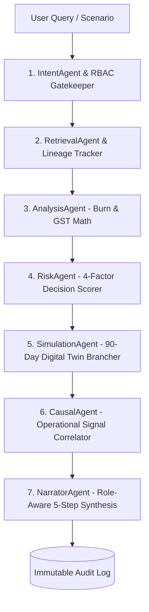

# 🚀 FinPilot AI — Complete Architectural Walkthrough & System Guide

**FinPilot AI** is an enterprise-grade **Financial Digital Twin & Autonomous Multi-Agent Decision Operating System**. Unlike conventional finance dashboards that merely report past transactions, FinPilot AI simulates forward-looking financial trajectories, detects causal anomalies, eliminates policy friction via self-calibration, and coordinates 7 specialized reasoning agents.

---

## 🌟 Core System Pillars

```
                     ┌─────────────────────────────────────────────────────────┐
                     │                 FINPILOT AI OPERATING SYSTEM             │
                     └────────────────────────────┬────────────────────────────┘
                                                  │
         ┌────────────────────────────────────────┼────────────────────────────────────────┐
         │                                        │                                        │
         ▼                                        ▼                                        ▼
┌──────────────────┐                    ┌──────────────────┐                     ┌──────────────────┐
│  FINANCIAL TWIN  │                    │   MULTI-AGENT    │                     │ SELF-CALIBRATING │
│  90-Day Forward  │                    │   ORCHESTRATOR   │                     │  POLICY ENGINE   │
│  State Simulator │                    │  7 Sub-Agents    │                     │ Friction Reducer │
└──────────────────┘                    └──────────────────┘                     └──────────────────┘
```

---

## 1. 🧬 Financial Digital Twin Engine (`digital_twin_service.py`)

### The Live State Model
The Digital Twin maintains an isolated, simulate-able replica of corporate finances:
- **Cash & Liquidity**: Live liquid reserves (₹8,435,000) and multi-horizon runway buffers.
- **Department Allocations**: Real-time spending velocity across Engineering, Marketing, Sales, Operations, and HR.
- **Payroll & Statutory Obligations**: 4 employee records with gross salary, statutory PF (12%), and TDS withholdings.
- **Invoice Commitments**: Pending and authorized invoices evaluated against line-item policy caps.
- **Composite Decision Health Score**: 83.8 / 100 (*Budget Impact Control 90.7%, Policy Compliance Check 91.0%, Historical Variance Stability 68.0%, Approval Risk Factor 84.0%*).

### 90-Day Forward Simulation (`simulate_forward`)
- Computes daily burn rates ($B_{\text{daily}} = \text{Annual Allocated} / 365$) and daily inflow rates ($I_{\text{daily}} = \text{Weekly Avg} / 7$).
- Simulates step-by-step liquidity shifts over 90 days with support for parameter modifiers (spend velocity shifts, vendor payment delays, and headcount additions).

### Branch Isolation (`simulate_action`)
- Clones baseline in-memory state so what-if hypotheses never mutate production ledgers.
- Outputs quantitative Before vs. After matrix ($\Delta$ Liquidity, $\Delta$ Runway Days, $\Delta$ Budget Utilization, $\Delta$ Decision Score) with automated verdict badges (`🟢 SAFE TO EXECUTE`, `🟡 REQUIRES GOVERNANCE`, `🔴 DEFICIT RISK DETECTED`).

---

## 2. 🤖 Multi-Agent Orchestrator Pipeline (`multi_agent_orchestrator.py`)

FinPilot AI routes financial reasoning through 7 specialized agents with deterministic hand-offs:



### Specialized Sub-Agent Roles:
1. **`IntentAgent`**: Classifies query intent (`COUNTERFACTUAL_SIMULATION`, `EXPENSE_AFFORDABILITY`, `CAUSAL_INVESTIGATION`, `BUDGET_RUN_RATE`, `AUDIT_COMPLIANCE`, `POLICY_CALIBRATION`) and enforces RBAC boundaries.
2. **`RetrievalAgent`**: Fetches verified records across ledgers with data lineage tracking.
3. **`AnalysisAgent`**: Computes quantitative burn rates, runaways, and mathematical GST tax consistency.
4. **`RiskAgent`**: Evaluates 4 composite risk factors (*Budget Impact, Compliance, Variance, Approval Risk*).
5. **`SimulationAgent`**: Executes 90-day simulations against the Digital Twin.
6. **`CausalAgent`**: Pinpoints root causes by correlating variances against nearby signals (vendor additions, submitter clustering, billing cycle shifts).
7. **`NarratorAgent`**: Formulates 5-step Decision Engine synthesis (*What Happened $\rightarrow$ Why It Matters $\rightarrow$ What Should Be Done $\rightarrow$ Who Needs to Act $\rightarrow$ What Happens Next*) with role-tailored depth.

---

## 3. ⚖️ Role-Aware Explainability & Access Control (RBAC)

FinPilot AI enforces strict enterprise security boundaries across 4 distinct roles:

| Role | Access Scope | Reasoning / Explanation Depth |
|---|---|---|
| **👑 CFO (Chief Financial Officer)** | Enterprise-wide (All Departments, Cash, Payroll, Tax, Audit, Policy) | Strategic 5-step synthesis, 90-day cash curve deltas, policy calibration controls |
| **💼 Finance Manager** | Enterprise Budgets, Invoices, Reconciliation, Approvals Queue | Operational metrics, runway projections, vendor analysis, invoice approval actions |
| **🛠️ Department Head** | Scoped strictly to own department (e.g. Engineering) | Localized budget burn rate, team expense affordabilities, allowance reviews |
| **🔍 Auditor** | Read-only across all financial ledgers, tax reconciliations, and logs | Multi-agent lineage traces, intermediate agent execution steps, deterministic rule scores |

---

## 4. 🧠 Causal Anomaly Detection Engine

Instead of flagging financial variances in isolation, FinPilot AI correlates flagged items against operational signals:

- **Case 1: Engineering Cloud Infrastructure Overrun**
  - *Primary Cause*: Unbudgeted Q2 Production Kubernetes Expansion (94% confidence).
  - *Correlated Signals*: 3 new CloudOps Technologies invoices in 14 days amounting to ₹200,600; AWS savings plan renewal variance (+18%); Submitter clustering (80% from same team lead).
  - *Recommended Fix*: Reallocate ₹250,000 from Operations surplus.

- **Case 2: Salary & Form 16 Reporting Mismatch**
  - *Primary Cause*: Unclassified reimbursement arrears omitted from quarterly Annexure B.
  - *Correlated Signals*: 2 records with discrepancy (EMP-1042: ₹35,000 diff; EMP-101: ₹96,000 diff).
  - *Recommended Fix*: Update Form 16 Part B before quarterly tax filing.

---

## 5. 🔄 Self-Calibrating Policy Engine (`policy_calibration_service.py`)

FinPilot AI learns from human reviewer overrides to eliminate false alarms:
1. **Friction Detection**: Tracks human decisions on AI-flagged items. When human reviewers override AI flags at $\ge 70\%$ (e.g. 8 of 10 travel claims approved), friction is detected.
2. **Calibration Proposals**: Generates structured proposals (e.g. `CALIB-PROP-001` to raise Senior Engineer travel allowance limit from ₹15,000 to ₹25,000).
3. **1-Click Execution**: CFO approves with 1 click; policies are updated in real-time and recorded in the audit trail.

---

## 6. 💻 Fintech UI & What-If Simulation Studio

The dark Razorpay-inspired UI features 14 specialized tabs:
1. **Financial Control Center**: Real-time position cards, decision alerts, dynamic time-series chart, and quick operations.
2. **Digital Twin & What-If Studio**: Interactive sliders (*Spend Velocity, Vendor Payment Delay, Headcount Growth*), Before vs. After comparison cards, dual-line Chart.js trajectory curve, causal explorer, and policy calibration proposals.
3. **Company Decision Map**: Hierarchical visual graph from Enterprise Root $\rightarrow$ Budgets & Cash $\rightarrow$ Departments $\rightarrow$ Spending Risk $\rightarrow$ Actions.
4. **Tax & Form 16 Reconciliation**: Cross-checks payroll registers against uploaded Form 16 Part A/B and 26AS TDS credits.
5. **Employee Finance & Allowances**: Salary computation engine, travel allowance caps, and appraisal revisions.
6. **Financial Copilot**: Natural language reasoning chat with voice controller and quick prompt chips.
7. **Two-Stage Hybrid Reconciliation**: Deterministic fast path and exception resolution.
8. **Cash Flow Forecast**: 7-day, 30-day, 90-day, and fiscal year liquidity horizons.
9. **Department Budgets & Runway**: Live allocations, committed spend, and year-end predictions.
10. **Invoice Intelligence & Simulator**: Expense affordability simulator and 18% GST tax auditor.
11. **Approvals Queue**: Human-in-the-Loop governance for transactions $\ge$ ₹50,000.
12. **Vendor Intelligence Radar**: Vendor spend concentration and anomaly frequency.
13. **Financial Watchtower Radar**: Real-time anomaly telemetry.
14. **Immutable Audit Trail**: Chronological compliance log of all actions, revisions, and multi-agent reasoning traces.

---

## 7. 🧪 Test Suite & Quality Verification

FinPilot AI includes comprehensive automated test coverage passing with 100% success:

```bash
# 1. Digital Twin & Multi-Agent Test Suite
python tests/test_digital_twin_and_agents.py

# 2. Decision Operating System Upgrade Suite
python tests/test_decision_engine_upgrade.py

# 3. AI Reasoning & Natural Language Chat Suite
python tests/test_ai_chat_pipeline.py
```

---

## 🚀 Quickstart Guide

### 1. Clone & Setup
```bash
git clone https://github.com/GAUTAMX05/FinPilot-Ai.git
cd FinPilot-Ai
```

### 2. Configure Environment
```bash
cp .env.example .env
# Set OPENAI_API_KEY and RAZORPAY credentials in .env
```

### 3. Launch Server
```bash
python run_server.py
```
- **Web UI**: `http://127.0.0.1:8000/`
- **Swagger Docs**: `http://127.0.0.1:8000/docs`
- **Health Check**: `http://127.0.0.1:8000/health`
